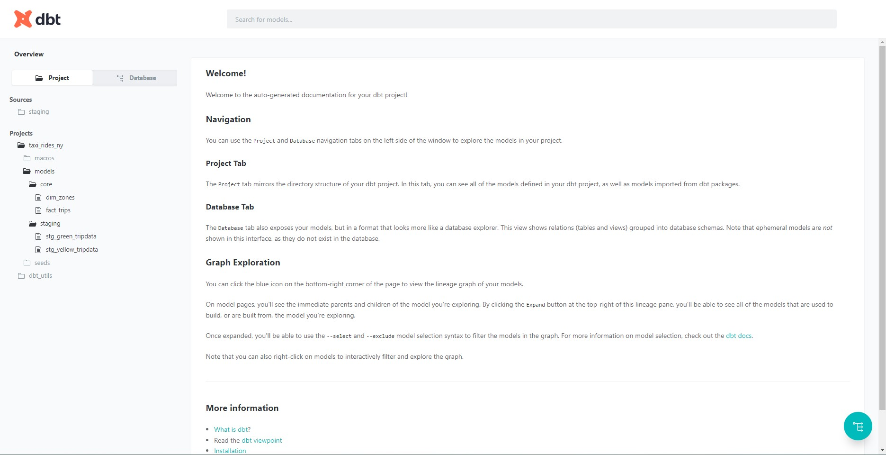
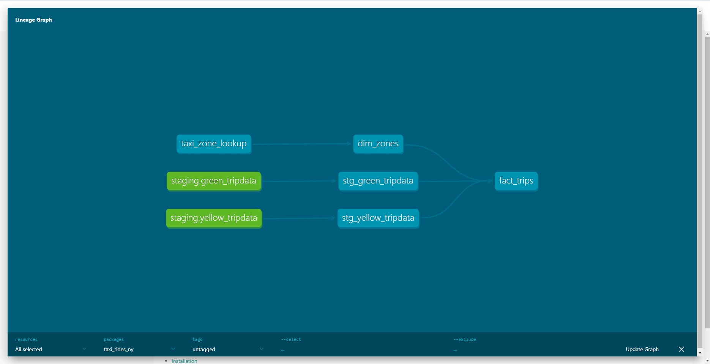

# DBT Project
In this analytics engineering practice case, I used my previous work on dbt which includes using green taxi and yellow taxi trip data.

## DBT Test
DBT Test is done on several tables, here is some examples of the test that is applied.

- **Table**: stg_green_tripdata  
    - **Column**: tripid  
    - **Tests**: not null and unique  
    - **Explanation**: column trip id is like the primary key of the table, so it needs to always be unique and have not null values  

- **Table**: stg_yellow_tripdata  
    - **Column**: Pickup_locationid  
    - **Tests**: relationships               
        - to: ref('taxi_zone_lookup')
        - field: locationid  
    - **Explanation**: this test ensures that values in column Pickup_locationid does exist as locationid in model taxi_zone_lookup 

- **Table**: stg_yellow_tripdata  
    - **Column**: Payment_type  
    - **Tests**: accepted_values
        - values: {{ var('payment_type_values') }}
    - **Explanation**: it means that value of column payment_type should always be like variabel payment_type_values, which is [1,2,3,4,5,6]  

## DBT Docs
Here is a snippet of the dbt docs. You can find the full version in path `dbt/taxi_rides_ny/target/index.html`

 
 

