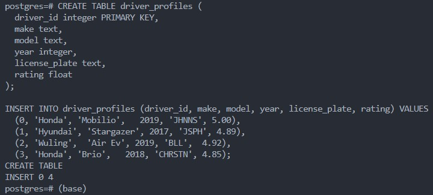
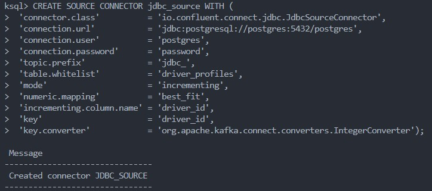
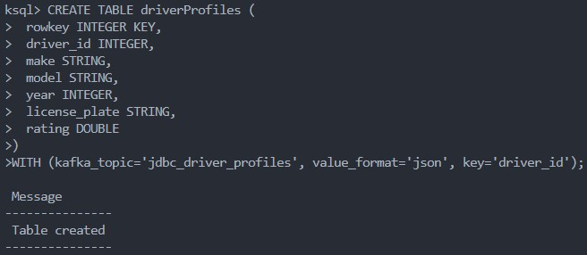
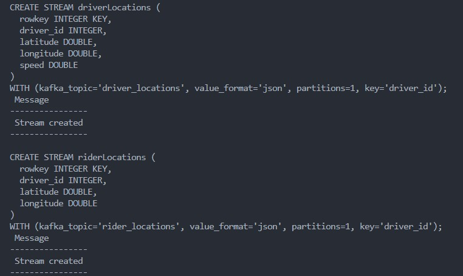
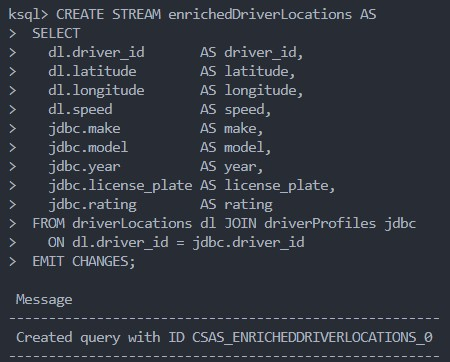
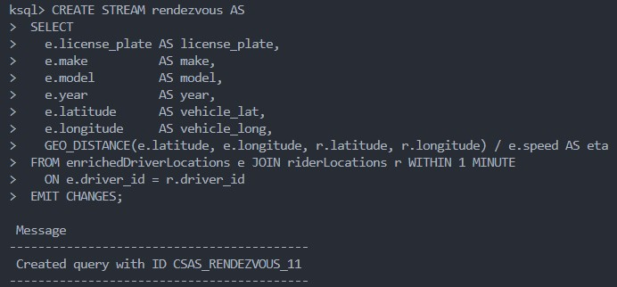
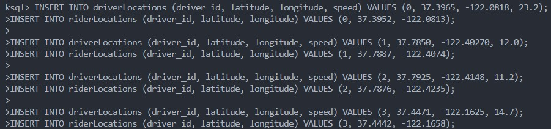
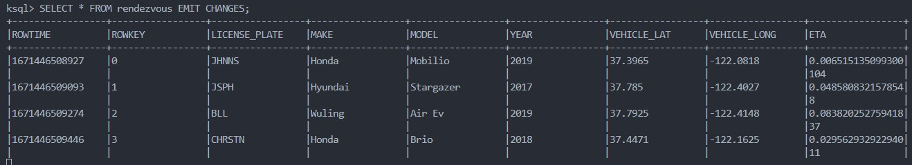

# Below is the result of connecting PostgreSQL with KSQL DB

1. Postgre create table

2. Create Postgre connector with KSQL

3. Create Postgre table in KSQL

4. Create KSQL Streams

***

***

***

5. Insert KSQL data and show results through query

***
